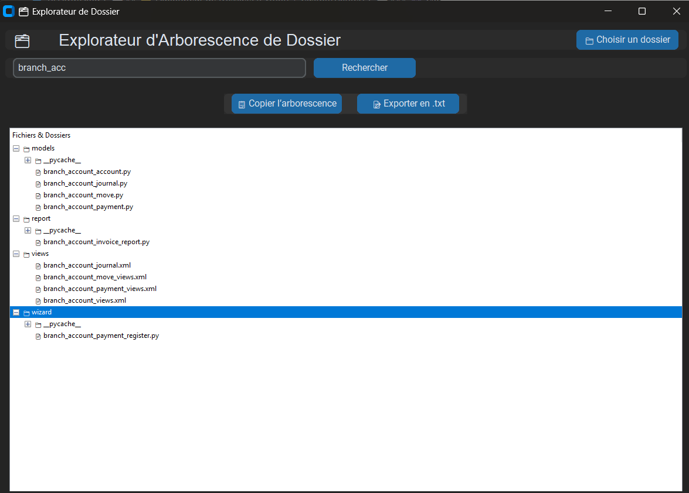
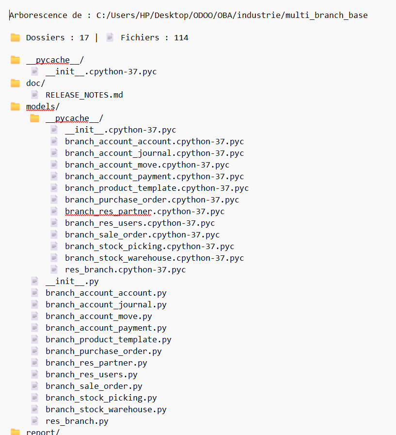

## 🗂️ Explorateur de Dossiers (Python + CustomTkinter)

Une application de bureau moderne et intuitive pour explorer visuellement l'arborescence des fichiers et dossiers sur votre système.
Fonctionnalités : affichage arborescent, recherche, copie dans le presse-papiers, exportation `.txt`, ouverture de fichiers, interface sombre moderne.

---

### 📸 Captures d’écran

#### 💡 Interface principale (avec arborescence chargée)


#### 🔍 Recherche dans l'arborescence



#### 📋 Copier & 📝 Exporter les données



---

### 🚀 Fonctionnalités

* 🔍 **Recherche** dans l'arborescence avec filtrage dynamique
* 📂 **Sélection de dossier** via une boîte de dialogue
* 📄 **Affichage TreeView** : dossiers et fichiers triés
* 📋 **Copier** l’arborescence dans le presse-papiers
* 📝 **Exporter** l’arborescence dans un fichier `.txt`
* 🖱️ Double-clic pour **ouvrir un fichier ou dossier**
* 🎨 UI **moderne et sombre** grâce à [CustomTkinter](https://github.com/TomSchimansky/CustomTkinter)

---

### ⚙️ Prérequis

* Python 3.8+
* [customtkinter](https://github.com/TomSchimansky/CustomTkinter)

---

### 📦 Installation

```bash
# Cloner le dépôt
git clone https://github.com/abdoul-GM/TreeView-Explorer.git
cd TreeView-Explorer

# Installer les dépendances
pip install customtkinter
```

---

### ▶️ Lancer l'application

```bash
python arborescence_dossier_scane.py
```

---

### 🗃️ Structure du projet

```
explorateur-dossiers/
├── arborescence_dossier_scane.py
├── screenshots/
│   ├── explorateur_export_copy.png
│   ├── explorateur_main_1.png
│   ├── explorateur_main_2.png
│   └── explorateur_search.png
└── README.md
```

---

### 📁 Exportation

Les arborescences exportées seront enregistrées par défaut dans :

```
~/Desktop/Arborescences_Exportée/
```

Avec un nom de fichier basé sur le dossier sélectionné.

---

### 🙌 Contributeurs

Développé par Abdoul.GM 🚀

---

### 📄 Licence

Ce projet est open-source sous licence MIT. Libre à vous de l'utiliser et de l'améliorer !

---

### 📬 Suggestions ou bugs ?

N'hésitez pas à ouvrir une *issue* ou proposer une *pull request* !
